# A3 Report

Author: Jashandeep Singh 

Date: 2024-10-19

Check [readme.txt](readme.txt) for course work statement and self-evaluation. 
  
## Q1 Transformations in CG (description)

### Q1.1 Principle of CG transformations

#### What are the three basic transformations?
Three basic transformations are

- Translation
- Rotation
- Scaling

#### What is a composite transformation?
A number of transformations or sequence of transformations can be combined into single one called as composition

#### Why Homogeneous coordinate system is used in transformation representation and computing?
Expressing positions in homogeneous coordinates allows us to represent all
geometric transformation equations as matrix multiplications, which is the standard method used in graphics systems. It makes formulas simpler and more symmetric. Also, A sequence of transformations can be multiplied into one single matrix for simple and efficient processing.

### Q1.2 Hand on 2D transformations

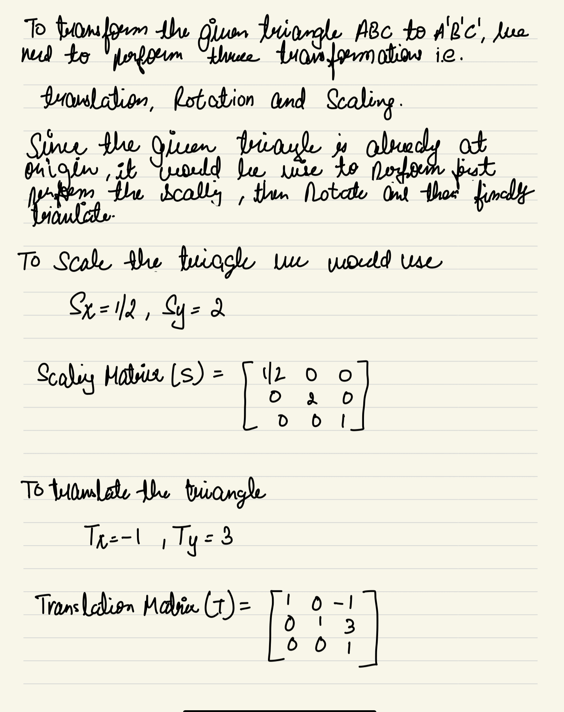{width=90%}
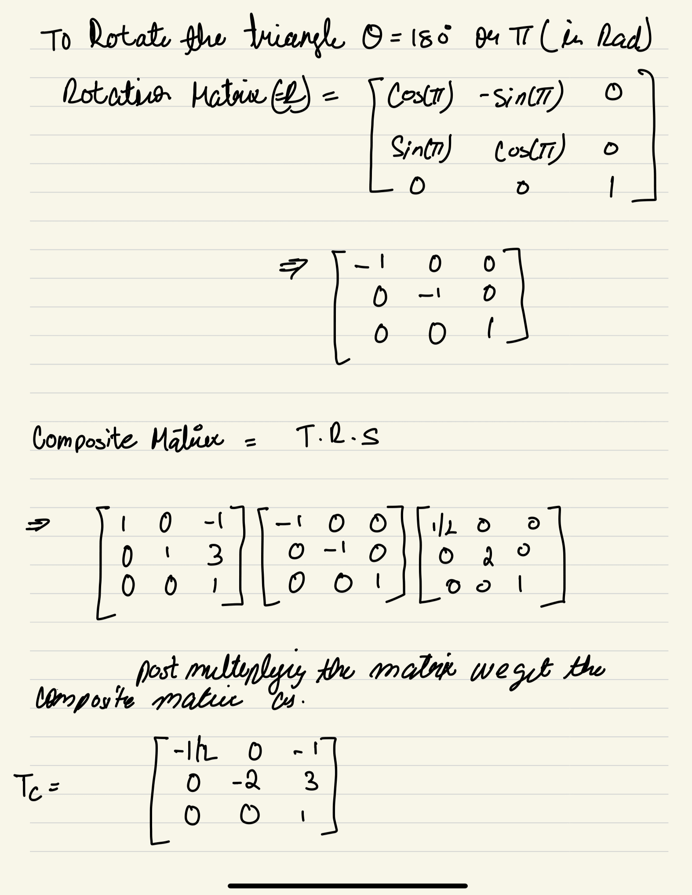{width=90%}
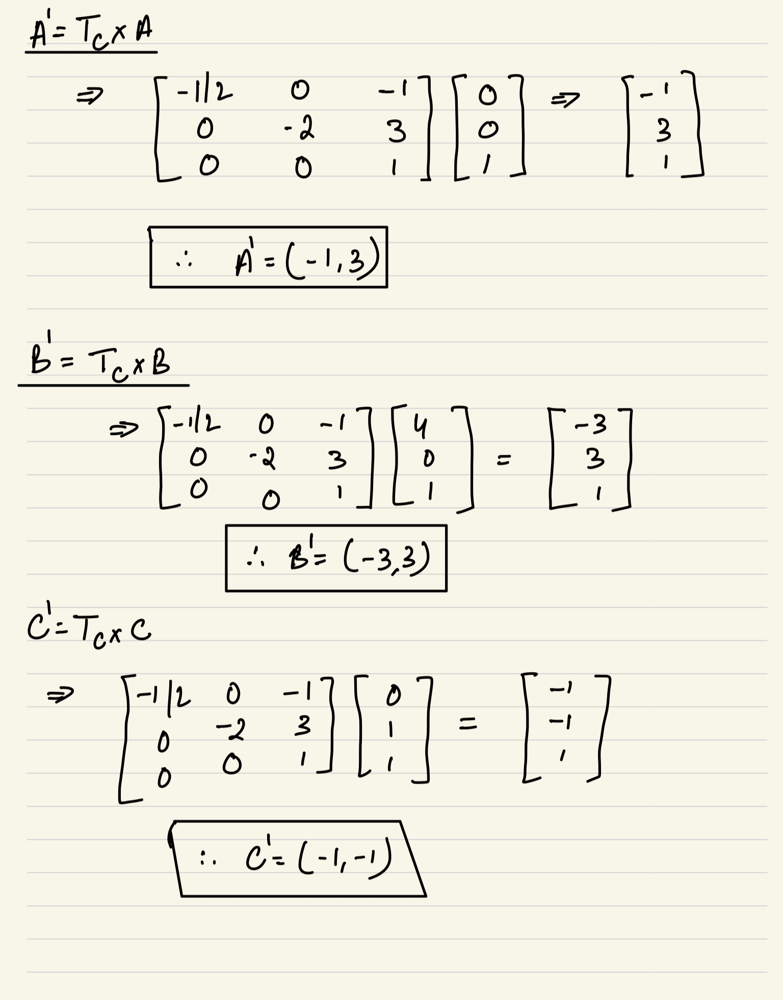{width=90%}

## Q2 CG transformation programming (lab practice)

### Q2.1 Warm up with C++ 

Complete? Yes 

### Q2.2 2D transformations 

Complete? Yes

<!--If you answer Yes, insert one or more screenshot images to show the completion.-->

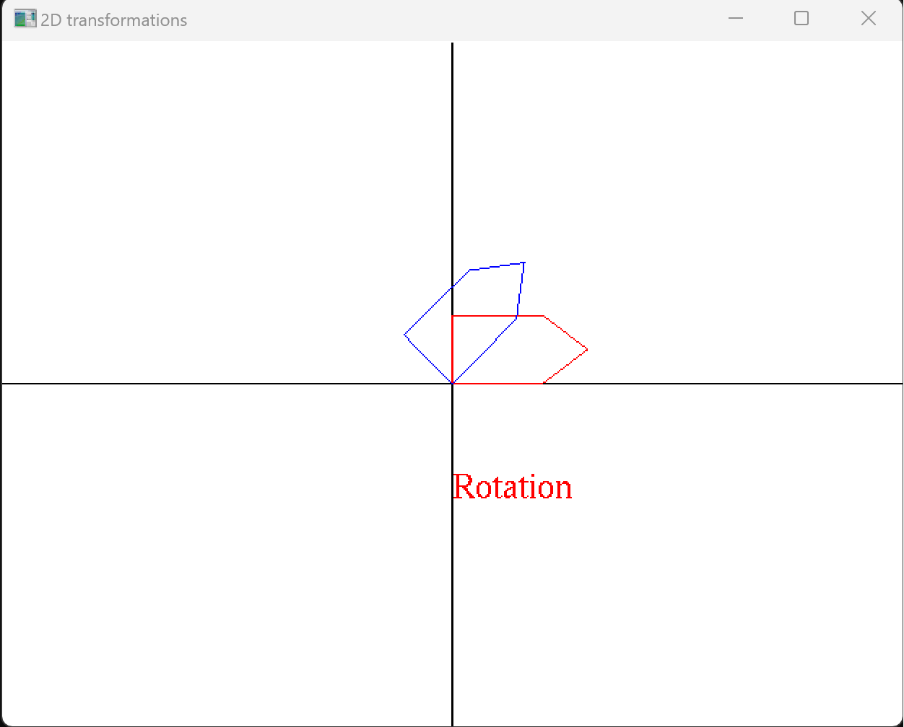{width=90%}

<!-- If No, add a short description to describe the issues encountered.-->

### Q2.3 3D objects and transformations 

Complete? Yes  

<!--If you answer Yes, insert one or more screenshot images to show the completion.-->

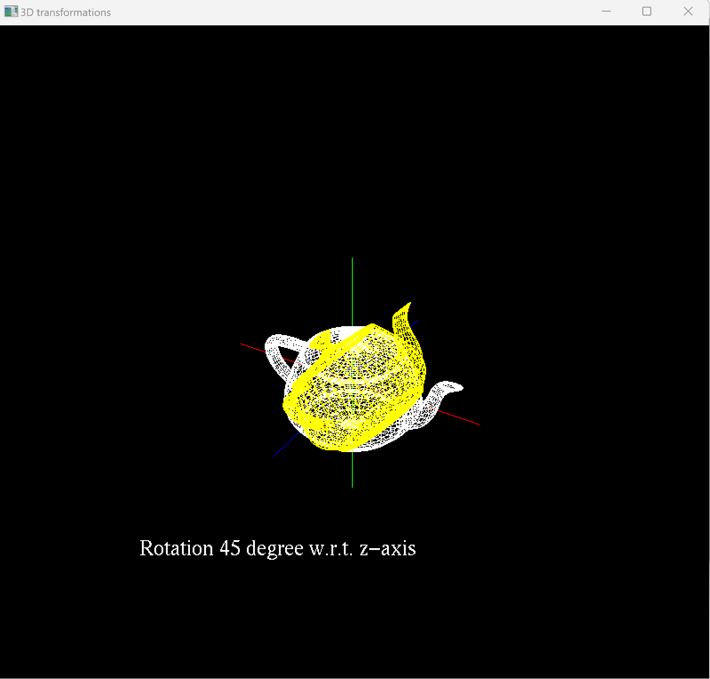{width=90%}

<!-- If No, add a short description to describe the issues encountered.-->

### Q2.4 Mesh object model 

Complete? Yes 
<!--If you answer Yes, insert one or more screenshot images to show the completion.-->

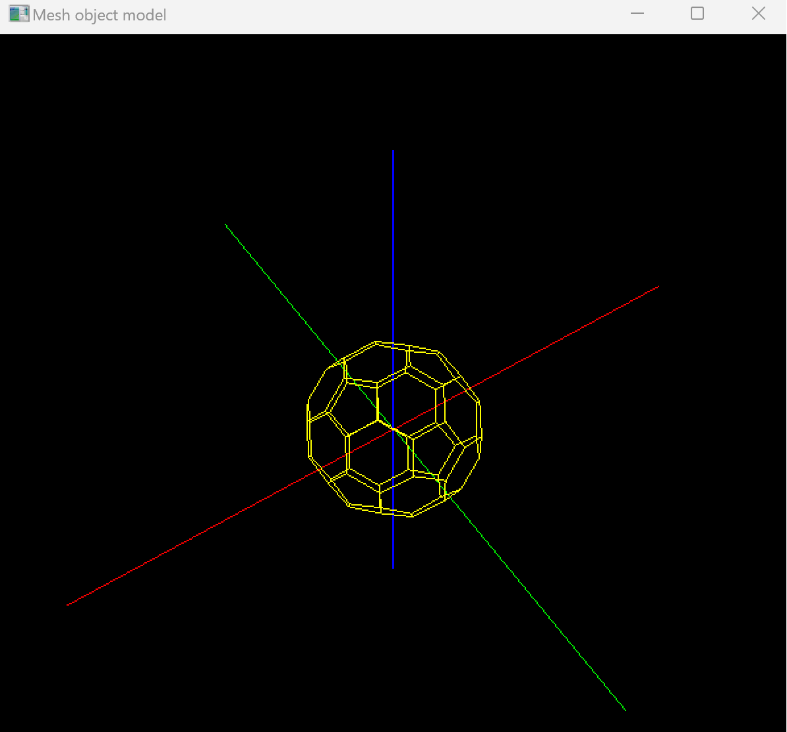{width=90%}

<!-- If No, add a short description to describe the issues encountered.-->

## Q3 SimpleView1 - transformations (programming)

### Q3.1 Create and render cube objects

Complete? Yes

<!--If you answer Yes, insert one or more screenshot images to show the completion. -->

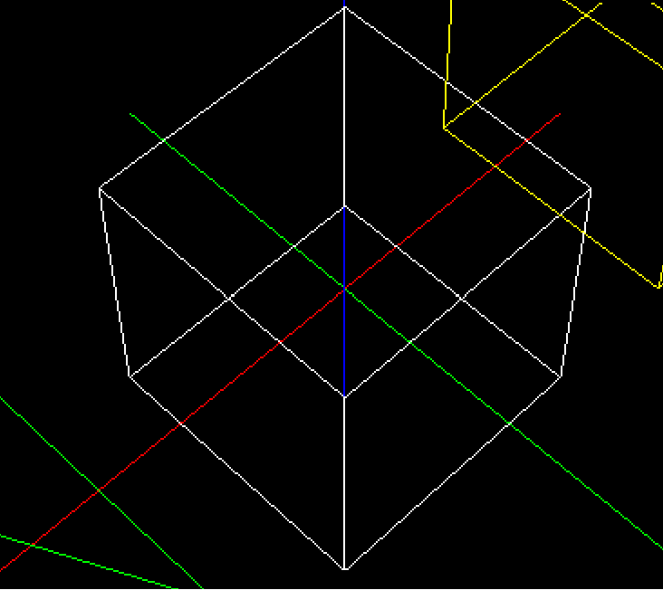{width=90%}

<!--If No, add a short description to describe the issues encountered.-->

### Q3.2 Create and render pyramid object

Complete? Yes  

<!--If you answer Yes, insert one or more screenshot images to show the completion. -->

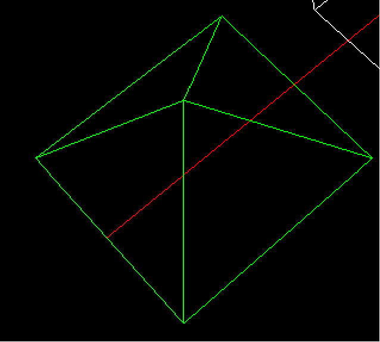{width=90%}

<!--If No, add a short description to describe the issues encountered.-->

### Q3.3 Create and render house object

Complete? Yes 

<!--If you answer Yes, insert one or more screenshot images to show the completion. -->

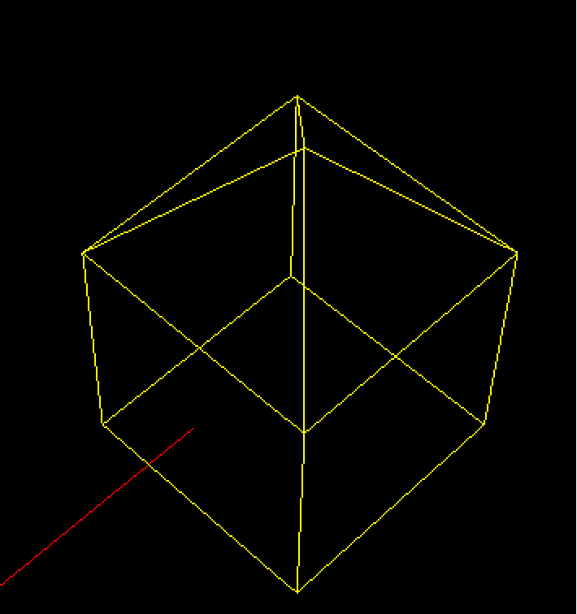{width=90%}

<!--If No, add a short description to describe the issues encountered.-->

### Q3.4 MCS transforms

Complete? Yes 

<!--If you answer Yes, insert one or more screenshot images to show the completion. -->

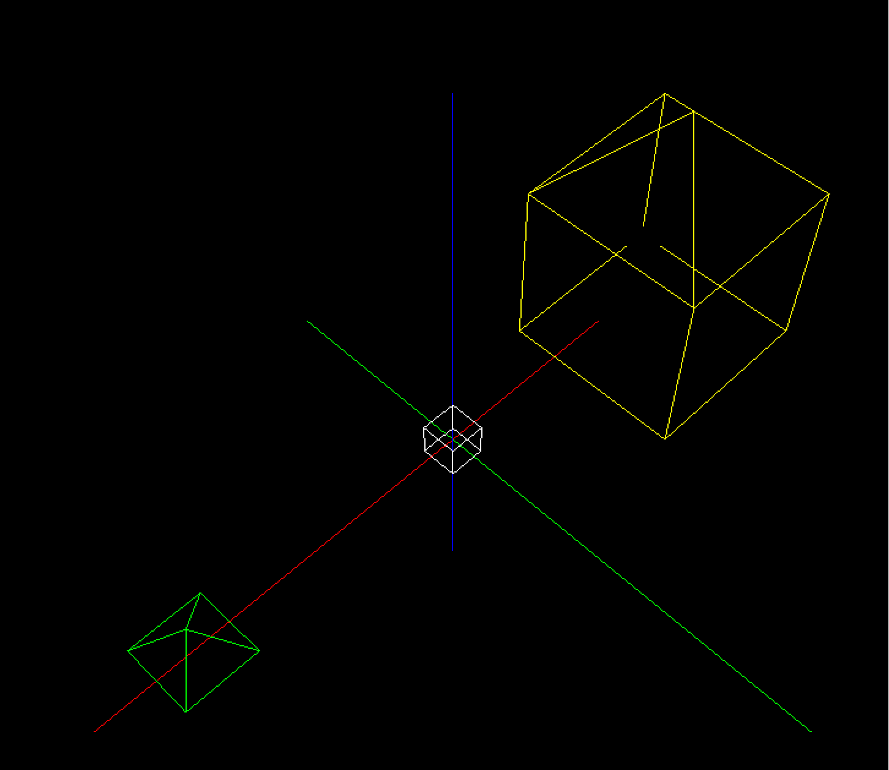{width=90%}

<!--If No, add a short description to describe the issues encountered.-->

### Q3.5 WCS transforms

Complete? Yes or No 

<!--If you answer Yes, insert one or more screenshot images to show the completion. -->

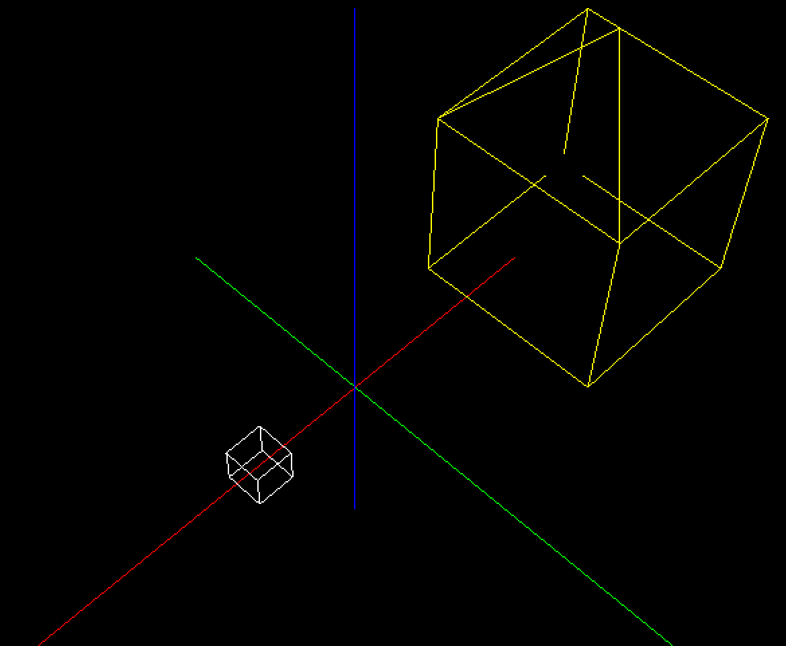{width=90%}

<!--If No, add a short description to describe the issues encountered.-->

### Q3.6 VCS transforms

Complete? Yes

<!--If you answer Yes, insert one or more screenshot images to show the completion. -->

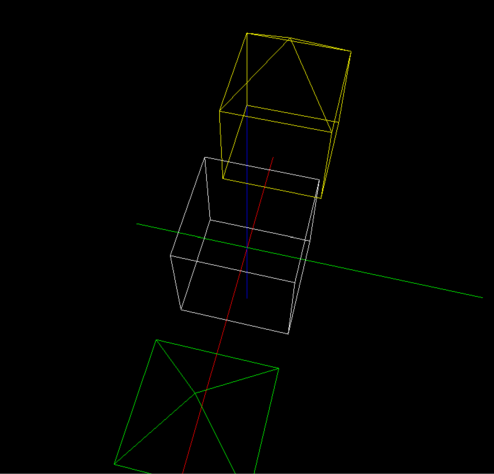{width=90%}

<!--If No, add a short description to describe the issues encountered.-->

**References**

1. CP411 a3
2. Add your references if you used any. 
